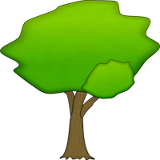
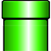

Objects
========================================

General Objects
---------------

Tree
""""

That's only a design element with no function.

Fire
""""

.. image:: fire.png
   :align: left

When you are big and you have eaten a fireflower, you can throw fireballs to your enemies (not all enemies will be dead if you throw it to them).

Box
"""

When you jump on its bottom, some :ref:`item <items>` is jumping out.

That can be (surprise, surprise!)

* a :ref:`good mushroom <goodmushroom>`,
* a :ref:`poison mushroom <poisonmushroom>`,
* or a :ref:`fireflower <fireflower>`.

Brick
"""""

A simple box where you can't go through with different colors.

Pipe
""""

A simple pipe with no special function.

.. _levelendobject:

Level-End-Objects
------------------

When you touch some level-end-object, you have finished the current level.

House
"""""

.. image:: house.png
   :align: left
   :width: 96
   :height: 128
   :scale: 70

Congratulations, you 've finished the current level.

Go and jump/run into it.

